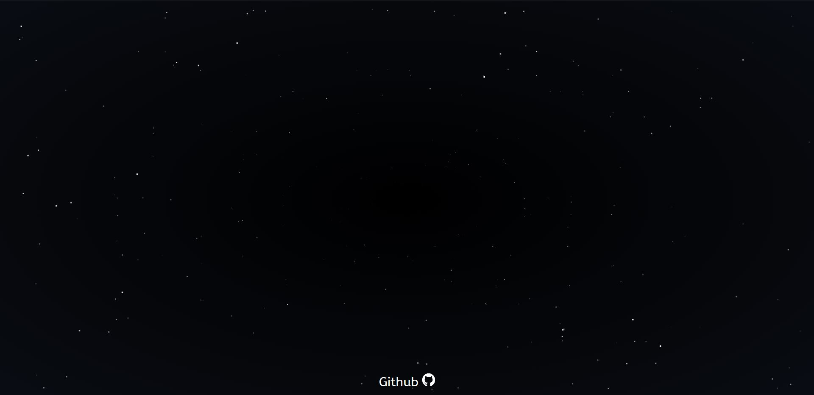
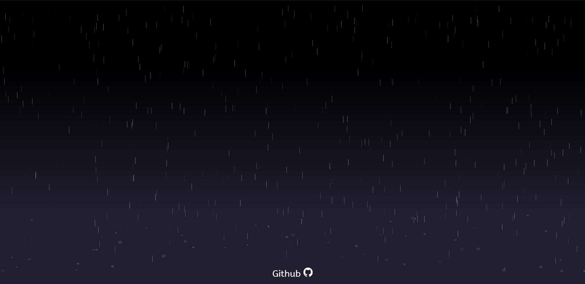
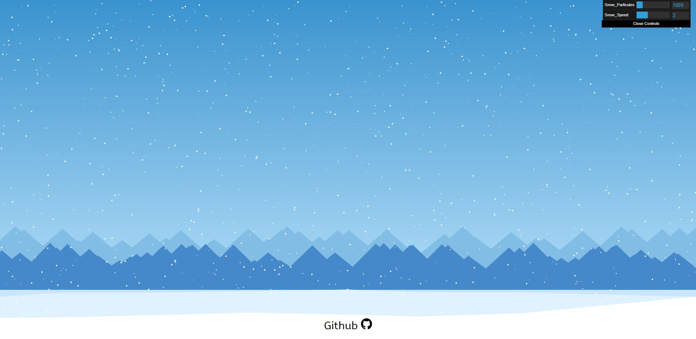

**DEMOS:**

1. ***Space Moving Background Animation:***  
  
  
<a href="https://yassinefikri.github.io/jsanims_demos/index1.html">demo</a>.  
<a href="https://codepen.io/yassinefikri/full/zYOyOby">CodePen demo</a>.   
js file to include on your web : "starsv3.js"

2. ***Fireworks Background Animation:***  
  
  
<a href="https://yassinefikri.github.io/jsanims_demos/index2.html">demo</a>.   
<a href="https://codepen.io/yassinefikri/full/GRKPRgN">CodePen demo</a>.  
js file to include on your web : "fireworksv9.js"  

3. ***Rain Background Animation:***  
  
  
<a href="https://yassinefikri.github.io/jsanims_demos/index3.html">demo</a>.   
<a href="https://codepen.io/yassinefikri/full/RwbmwJX">CodePen demo</a>.  
js file to include on your web : "rainv3.js" 

4. ***WindTurbines Background Animation:***  
  
  
<a href="https://yassinefikri.github.io/jsanims_demos/index4.html">demo</a>.   
<a href="https://codepen.io/yassinefikri/full/rNNNNox">CodePen demo</a>.  
js file to include on your web : "windTurbinev3.js"  

5. ***Snow Background Animation:***  
  
  
<a href="https://yassinefikri.github.io/jsanims_demos/index5.html">demo</a>.   
<a href="https://codepen.io/yassinefikri/full/dyyeapQ">CodePen demo</a>.  
js file to include on your web : "snowv5.js"   
  
**USAGE:**  
  
- add to your html ```<div id="canvas_container"><canvas></canvas><div>```
- include the js animation file you want  
- set the height & width you want to the canvas parent (canvas_container)
- in case you have multiple canvas on your web , consider adding an id to the canvas you want and changing this selector ```var canvas= document.querySelector("canvas");``` to ```var canvas= document.getElementById("yourID");```