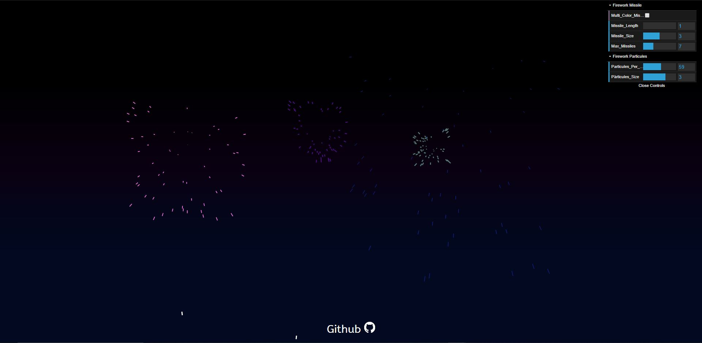

**DEMOS:**

1. ***Space Moving Background Animation:***  
  
  
<a href="https://yassinefikri.github.io/jsanims_demos/index1.html">demo</a>.  
<a href="https://codepen.io/yassinefikri/full/zYOyOby">CodePen demo</a>.   
js file to include on your web : "starsv3.js"

2. ***Fireworks Background Animation:***  
  
  
<a href="https://yassinefikri.github.io/jsanims_demos/index2.html">demo</a>.   
<a href="https://codepen.io/yassinefikri/full/GRKPRgN">CodePen demo</a>.  
js file to include on your web : "fireworksv9.js"  

3. ***Rain Background Animation:***  
  
  
<a href="https://yassinefikri.github.io/jsanims_demos/index3.html">demo</a>.   
<a href="https://codepen.io/yassinefikri/full/RwbmwJX">CodePen demo</a>.  
js file to include on your web : "rainv3.js" 

4. ***WindTurbines Background Animation:***  
  
  
<a href="https://yassinefikri.github.io/jsanims_demos/index4.html">demo</a>.   
<a href="https://codepen.io/yassinefikri/full/rNNNNox">CodePen demo</a>.  
js file to include on your web : "windTurbinev3.js"  

5. ***Snow Background Animation:***  
  
  
<a href="https://yassinefikri.github.io/jsanims_demos/index5.html">demo</a>.   
<a href="https://codepen.io/yassinefikri/full/dyyeapQ">CodePen demo</a>.  
js file to include on your web : "snowv5.js"   
  
**USAGE:**  
  
- add to your html ```<canvas></canvas>```  
- include the js animation file you want  
- set width & height you want inside the __size__ function (in the js file)  
```
function size(){  
    cw= document.body.clientWidth; 
    ch= window.innerHeight;
    ...
    ...
}
```
so by default i set width & height to take full screen, so you can change them if you want  
cw --> width  
ch --> height  
in case you choosen fixed values for the width & height (like 400px, 600, 1000 ...) that doesn't depend on the window dimensions, consider commenting the function __resize__ and the window resize listener (make them comment by adding '/\*' before and '\*/' after)  
1- 
```window.onresize = resize;```  
2-  
```  
function resize() {  
...  
...  
}  
```  
- in case you have multiple canvas on your web , consider adding an id to the canvas you want and changing this selector ```var canvas= document.querySelector("canvas");``` to ```var canvas= document.getElementById("yourID");```
